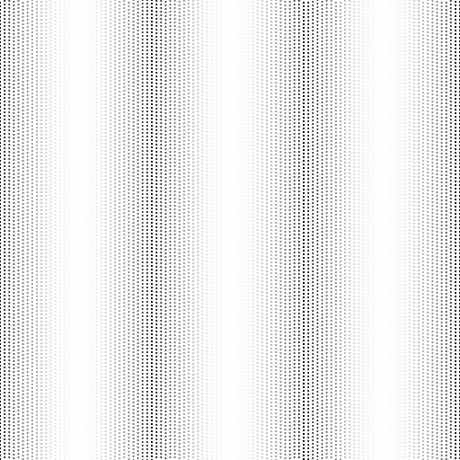

# SoundWaveGraphicsRenderer
A small program to render a figure that illustrates the air particles affected by a sound wave. The figure has been used in my thesis work about Fourier Transform.
## How Is The Figure Rendered?
The figure is built up by drawing vertical lines at equal intervals. While the darker dots show the compression of the particles in the air, the lighter ones show the rarefaction.
To darken and lighten the colors of the lines, an interpolation function is applied to the alpha channel of the lines' colors. In my case, the function was cos(2*pi*3*x). In addition, I randomized the vertical coordinates of the lines.
So, that is all.

And the result is as follows.

